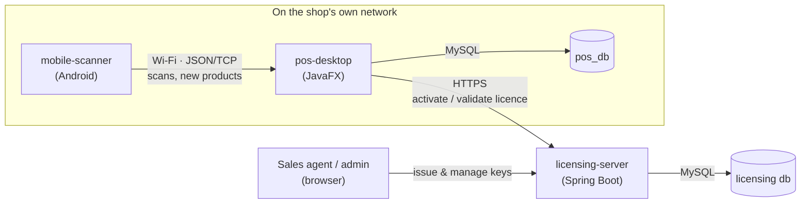

# Mbuyedzedzo

A point-of-sale platform built solo, end to end: a JavaFX desktop POS, an
Android companion scanner, and a Spring Boot licensing/subscription backend
that turns the desktop app into a licensed, offline-capable commercial
product. Three components, three different runtimes (JVM desktop, JVM
server, Android), talking to each other over the network — kept in one
repository because they ship and version together.



## The three components

| | What it is | Look here for |
| --- | --- | --- |
| **[`pos-desktop`](pos-desktop)** | The JavaFX point-of-sale app shops actually run — sales, inventory, staff, customers, reports, receipts | Two products from one codebase (a build-time edition flag), the `jlink`/`jpackage` Windows installer pipeline, offline licence verification |
| **[`licensing-server`](licensing-server)** | Spring Boot service + admin portal that issues and validates licence keys for the desktop app | Machine-bound activation, RS256 offline tokens, an admin portal with role-scoped agents |
| **[`mobile-scanner`](mobile-scanner)** | Android app that turns a phone into a wireless barcode scanner for the desktop till | A hand-rolled JSON-over-socket protocol, QR-code pairing |

Each has its own README with full setup instructions — this one is the map.

## Why it's split this way

- **`pos-desktop` ↔ `mobile-scanner`**: no shared code or language (Java desktop vs. Android), talk only over a local socket — separate deployables, same repo for coordinated versioning.
- **`pos-desktop` ↔ `licensing-server`**: the desktop is licensed software; the server is what makes that real (issuing keys, verifying activations) rather than a client-side flag. They share nothing but an HTTPS contract and an RSA public key.

## Engineering highlights

A few things worth a closer look if you're skimming:

- **One codebase, two shipped products.** `pos-desktop`'s "Standard" and "Retail" editions are the same jar with a build-time flag (`com.pos.Edition`) — different screens compile in or out, not a runtime toggle. See [`pos-desktop/README.md`](pos-desktop/README.md#editions--two-products-one-codebase).
- **Licensing that works offline.** The desktop verifies its licence with a bundled RSA public key on every launch (no network required) and only *phones home* in the background to catch revocations, with a 14-day grace window if it can't reach the server. See [`licensing-server/README.md`](licensing-server/README.md#how-licensing-works).
- **A real installer, not a jar someone double-clicks.** `jlink` builds a stripped custom JRE, `jpackage` + WiX wraps it into a Windows `.exe` that bundles MySQL and installs it silently on first run — the customer never sees Java or a database.
- **A hand-rolled device protocol.** The Android scanner and the desktop speak line-delimited JSON over a plain socket the desktop hosts — no MQTT/Firebase/cloud relay, because there's no reason a phone and a till on the same counter need one. See [`mobile-scanner/README.md`](mobile-scanner/README.md#how-it-connects).
- **Verified, not assumed.** Where the effect of a change couldn't be eyeballed easily — a JavaFX centering fix, an installer build actually producing a working `.exe`, an icon actually embedding — it was checked with an offscreen render, a real build, or a pixel measurement rather than taken on faith.

## Tech stack

| | |
| --- | --- |
| Desktop | Java 22, JavaFX 22, MySQL, HikariCP, Maven, `jlink`/`jpackage`, WiX |
| Server | Java 21, Spring Boot 3.3, Spring Security, Thymeleaf, MySQL, Flyway, Nimbus JOSE (RS256) |
| Mobile | Android (Java, min SDK 24), ZXing, Gradle |
| Shared concerns | Gson (wire protocols), Apache POI (Excel), iText 5 (PDF), Jakarta Mail |

## Getting started

Each component is independently runnable — pick the one you want and follow
its README:

```
git clone <this-repo-url> && cd <repo-folder>
cd pos-desktop      && mvn javafx:run          # desktop app, dev mode
cd licensing-server && mvn spring-boot:run     # licensing server + admin portal
cd mobile-scanner   && ./gradlew installDebug  # Android app, needs a device/emulator
```

## License

Portfolio/personal project — not licensed for redistribution.
